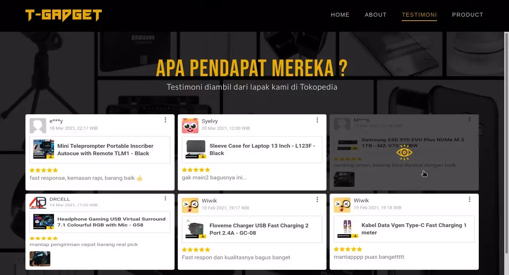
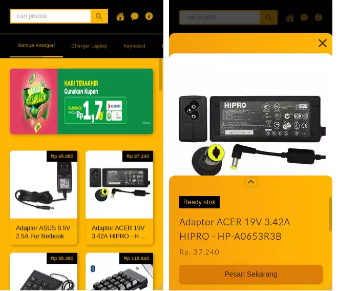

# T-Gadget Home Page

## 1. Tools & Stack
- [x] VS Code
- [x] PhpMyadmin
- [x] PHP Native (MVC)
- [x] Tailwind
- [x] JQuery
- [x] glide.js
- [x] GSAP

## 2. Preview
Live Demo Can access at <a href="https://t-gadget.herokuapp.com/">https://t-gadget.herokuapp.com/</a>   

> Home
>   

> About
>   

> Testi
>   

> Product
>   

> Mobile  
>   
>   