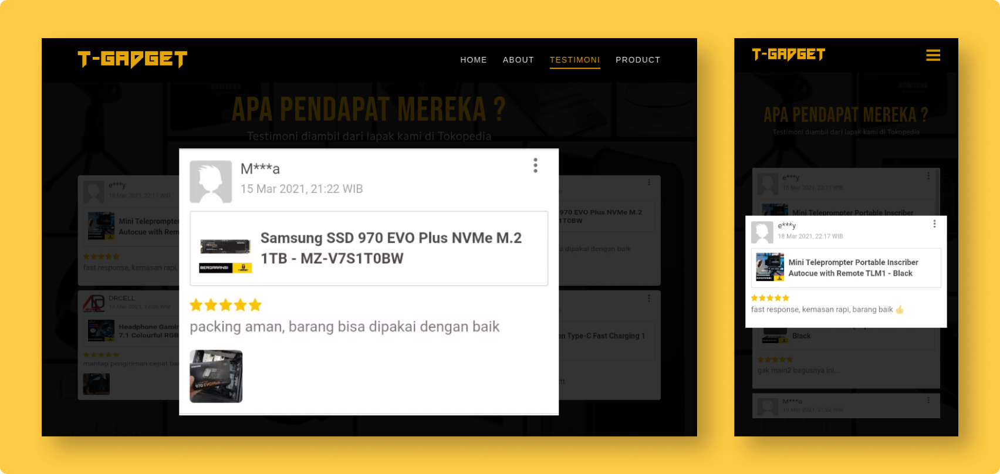
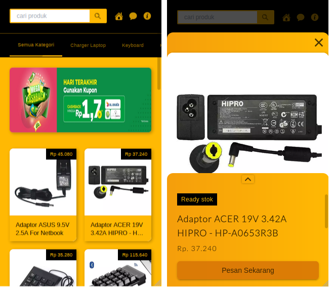

# T-Gadgetid Home Page
Tgadgetid is a website that I created for introducing my friend's products on Tokopedia. All data is fetched from my RESTFUL API at https://github.com/korospace/t-gadgetapi

## 1. Tools & Stack
- [x] PHP Native (MVC)
- [x] Tailwind
- [x] glide.js
- [x] GSAP

## 2. Preview
Live Demo Can access at <a href="https://t-gadget.herokuapp.com/">https://t-gadget.herokuapp.com/</a>   

> Home
>   

> About
>   

> Testimonies
>   

> Product
>   

> Mobile
>   